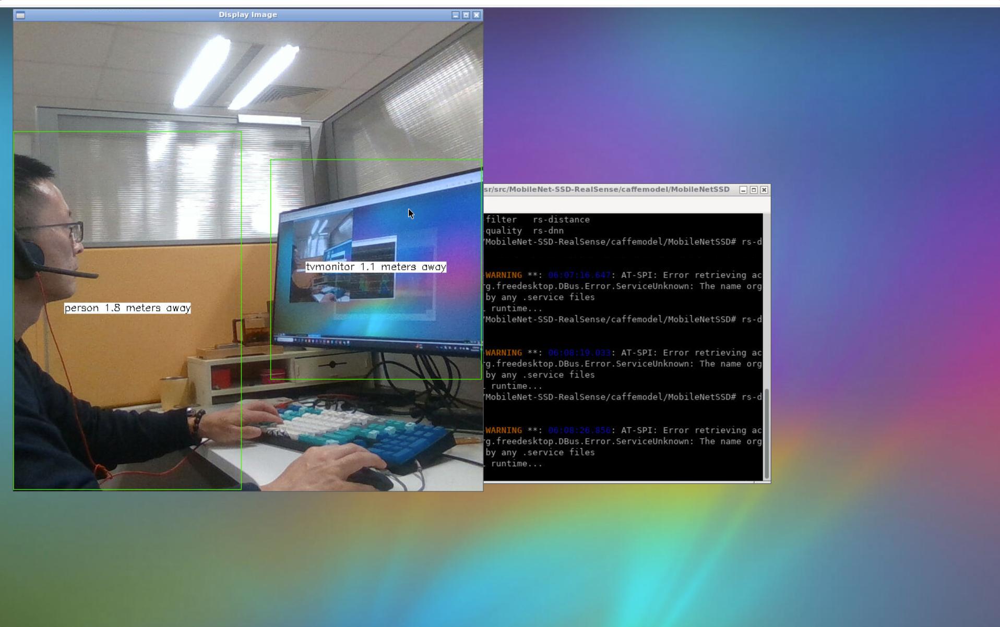

# realsense with vnc and opencv

## Overview

This realsense demo for D415, can use for D415 example and opencv

## realsense docker build

REPO=realsense TAG=v0.2 make build

## realsense docker run

REPO=realsense TAG=v0.2 make run


## vnc and run example

open http://<host ip>:6080 to open vnc

running rs-dnn

<p align="center"></p>

```bash
cd /usr/src/MobileNet-SSD-RealSense/caffemodel/MobileNetSSD
rs-dnn
```
running realsense-viewer

```bash
realsense-viewer
```
for details refer to [readme](https://github.com/IntelRealSense/librealsense/blob/master/wrappers/opencv/dnn/readme.md)

